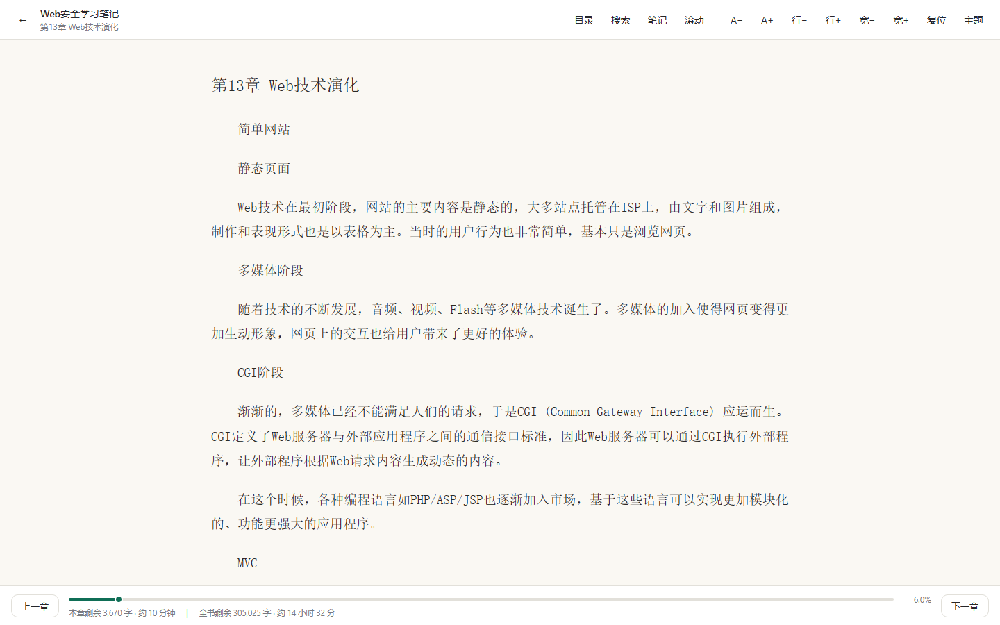
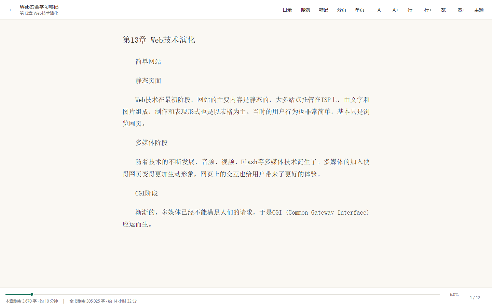
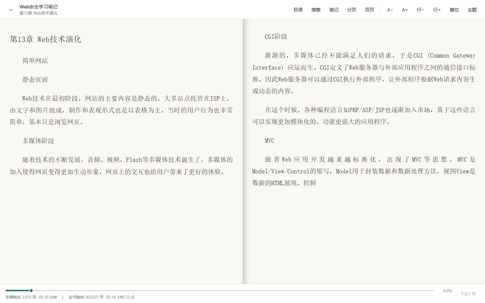
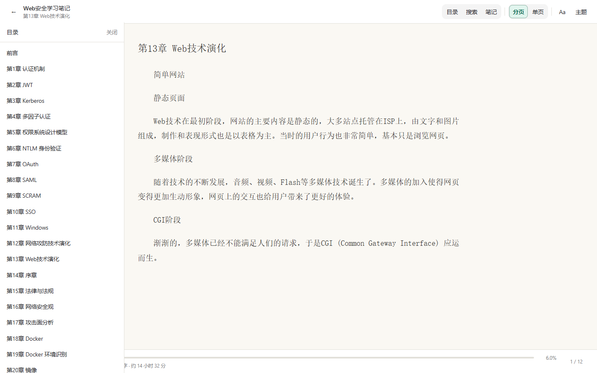
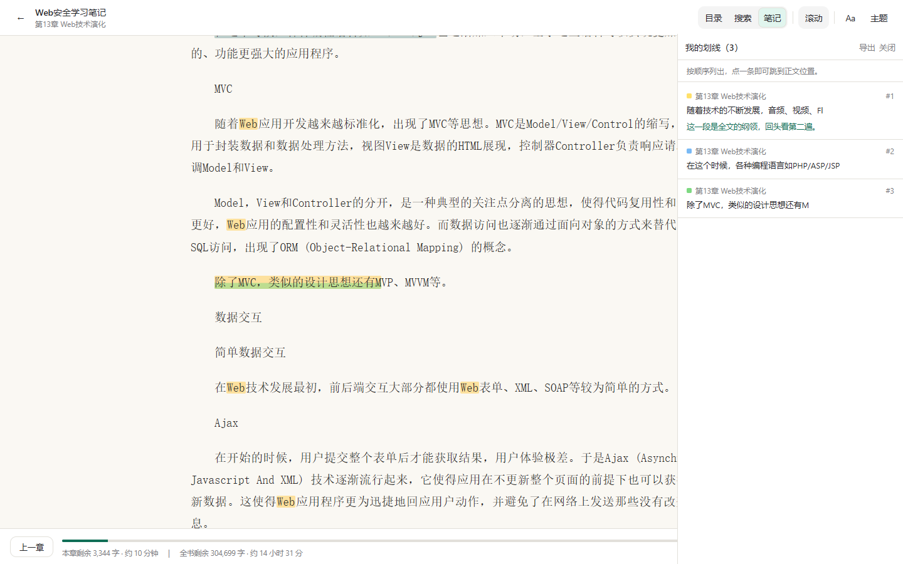
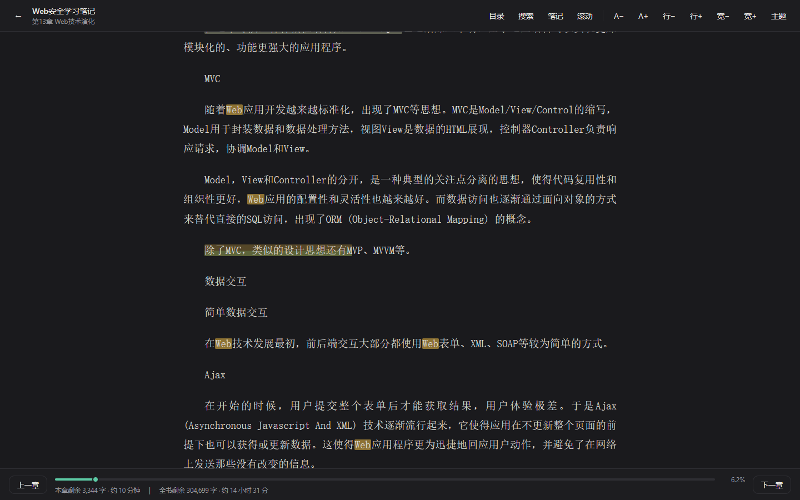

# MingScribe

[](https://github.com/0xm1ng/MingScribe/actions/workflows/ci.yml)
[](https://github.com/0xm1ng/MingScribe/releases/latest)
[](LICENSE)
[](#运行测试)
[](#许可)

一个**纯前端、零依赖**的电子书阅读器，外加一个可选的**桌面壳**。

- **网页版**：双击 `index.html` 就能用，不需要装任何东西、不需要起服务器、不需要联网。读 TXT 与 EPUB。
- **桌面版**：套了一层 [Tauri](https://tauri.app/) 壳，额外接上 [Calibre](https://calibre-ebook.com/) 的 `ebook-convert`，于是 MOBI / AZW3 / DOCX / FB2 / RTF / ODT 等格式也能读——它们先被转成 EPUB，再走同一套阅读流程。

功能：滚动与真分页（一屏一页、可双页对开）、目录、全文搜索、四种颜色划线与批注、导出 Markdown（可直接进 Obsidian）、阅读进度与字号行距记忆、日间/夜间主题。

技术上的两个关键取舍：

1. **所有格式先转成同一个中间结构**（章节列表 + 纯文本），显示层只认它。所以加 EPUB、加桌面版多格式，都没有改动进度、搜索、划线、导出任何一行。
2. **阅读位置一律用「第几章 + 章内第几个字」记录，不用页码。** 因此改字号、改窗口大小、切滚动/分页，位置都不会漂。

## 界面

截图里的书都是公开授权的开源读物（《Web安全学习笔记》《Hello-CTF》《OWASP 测试指南》与古腾堡版《山海經》）。

**书架** —— TXT 与 EPUB 都能进书架，下次点一下直接续读：


**滚动模式**（默认）—— 正文按「页宽」档位居中，长书滚动也不卡：



**分页模式** —— 一屏一页、整页替换，底部显示页码：



**双页对开** —— 宽屏自动开启，窄屏自动回到单页，也能手动切：



**目录**与**全文搜索** —— 跨章节检索、正文高亮、`Enter` 在命中之间跳：




**四色划线与批注** —— 右侧面板列出全部划线，点一条跳回正文；也可导出 Markdown：



**夜间主题** —— 与日间共用同一套锚点，切换不影响阅读位置：



## 快速开始

### 网页版（读 TXT / EPUB）

双击 `index.html` 即可。想跑测试：

```bash
npm test
```

### 桌面版（多格式）

不想自己编译 Rust？直接到 [Releases](https://github.com/0xm1ng/MingScribe/releases/latest) 下载 Windows x64 安装包：

| 文件 | 体积 | 说明 |
|---|---|---|
| `MingScribe_0.1.0_x64-setup.exe` | 1.83 MB | 常规安装程序，推荐 |
| `MingScribe_0.1.0_x64_en-US.msi` | 2.75 MB | 适合企业批量部署 |

> 安装包**未做代码签名**，首次运行时 Windows SmartScreen 会提示「已保护你的电脑」——点「更多信息」→「仍要运行」即可。

要自己编译，则需要 Rust 与 Calibre，详见下方「桌面版与多格式支持」一节：

```bash
npm install
npm run tauri:dev
```

## 怎么用

网页版操作方式：

| 操作 | 方式 |
|---|---|
| 打开书 | 点「选择 TXT / EPUB 文件」 |
| 滚动 / 分页模式 | 顶部「滚动」/「分页」按钮切换（分页 = 固定一屏一页） |
| 上一章 / 下一章 | 底部按钮；滚动模式下键盘 `←` `→` |
| 翻一页 | 分页模式下键盘 `←` `→`、`PageUp` / `PageDown` / 空格，或点页面左右两侧 |
| 跳到本章开头 / 结尾 | `Home` / `End`（分页模式为本章首页 / 末页） |
| 目录 | 顶部「目录」按钮，`Esc` 关闭 |
| 字号 | 顶部 `A−` / `A+`（16 ~ 26px 共 6 档） |
| 行距 | 顶部 `行−` / `行+`（1.55 ~ 2.3 共 6 档） |
| 页宽 | 顶部 `宽−` / `宽+`（共 6 档；滚动与分页模式都生效，双页对开下隐藏，每页宽由容器自动决定） |
| 日间 / 夜间 | 顶部「主题」按钮 |
| 全文搜索 | 顶部「搜索」按钮，或 `Ctrl` / `Cmd + F` |
| 搜索结果间跳转 | `Enter` 下一处、`Shift + Enter` 上一处 |
| 快进 / 快退 | 拖动底部进度条；进度条聚焦时 `←` `→` 每次 1% |
| 划线 | 选中正文一段文字 → 浮出的工具条上点颜色（黄 / 绿 / 蓝 / 粉） |
| 写批注 | 选中文字后点「批注」，或点击已有划线；`Ctrl + Enter` 保存 |
| 我的划线 | 顶部「笔记」按钮，或 `Ctrl` / `Cmd + M`；点列表项跳回正文 |
| 导出笔记 | 打开「笔记」面板 → 点「导出」，得到 `<书名>-笔记.md` |
| 关闭面板 | 点面板以外的任意位置即可（目录 / 搜索 / 笔记 / 批注弹层都一样）；`Esc` 也可 |

**两种阅读模式**：默认是连续的**滚动**模式；点顶部「滚动」按钮切到**分页**模式后，一屏就是一页，翻页是整页替换，底部的「上一章 / 下一章」会换成页码（如 `3 / 12`）。分页模式里还能切**双页对开**（页码形如 `1–2 / 12`，一屏左右两页并排），宽屏默认开启、窄屏自动回到单页，也能手动用顶部「单页 / 双页」按钮覆盖。`Esc` 关闭面板、划线、搜索、批注、导出这些功能在两种模式下都完全一样。

**改字号 / 行距 / 页宽都不会丢位置。** 因为这些参数一改就会按同一处文字重新切页，读者看到的始终是刚才那一段。窗口大小变化同理。

在批注框里打了字但没点「保存批注」就关闭，内容会**自动保存**，不会丢。

阅读进度会自动保存。关掉页面再打开，选同一个文件，就会回到上次的位置。
底部状态行会实时显示「本章剩余多少字、大约还要读多久」，以及「全书剩余」。
划线同样自动保存，且**改字号、改窗口大小都不会漂移**——它和阅读进度用的是同一套锚点。

导出的 Markdown 按章节分组，原文以引用块呈现（因此原文里带 `#`、`>` 也不会把文档结构搞乱），可以直接丢进 Obsidian 之类的笔记软件。

## 目录结构

```
index.html          入口页面
src/
  encoding.js       编码识别：UTF-8 / UTF-16 / GB18030
  parser.js         解析层：纯文本 → 统一中间格式
  epub.js           解析层：EPUB → 统一中间格式（自带 ZIP 读取，零依赖）
  paginate.js       分页：一章文本 → 页边界（纯函数，锚点仍是字符偏移）
  progress.js       进度存储：章节序号 + 章节内字符偏移
  search.js         全文搜索：跨章节检索 + 高亮（纯函数，可独立测试）
  decorate.js       正文装饰：划线（外层）与搜索命中（内层）交叉渲染
  annotations.js    划线 / 批注存储：区间锚点 + 重叠拒绝
  exporter.js       导出 Markdown：按章节分组、原文引用块化
  bookstore.js      书籍缓存：文件句柄持久化 + 正文缓存（三级降级）
  app.js            显示层：界面与交互
  style.css         样式
tests/              Node 内置测试运行器，无第三方依赖
tools/              ebook 素材构建 / 格式转换自检 / 端到端自检 / README 截图生成等辅助脚本
src-tauri/          桌面版（Tauri + Rust）：convert_to_epub 命令调用 ebook-convert
```

`tests/modules.test.js` 是一道特殊的守卫：它在**没有 `module` / `require` 的沙箱**里加载每个 `src` 脚本，模拟真实浏览器环境，校验「每个模块都挂上了 `window.MingScribe`」以及「`app.js` 用到的模块都写了 `var X = window.MingScribe.X;`」。

这道守卫是补票上的——之前 `src/epub.js` 忘了挂全局、`app.js` 忘了声明，**单元测试全绿但页面一点就报 `Epub is not defined`**。因为 Node 测试走 UMD 的 `module.exports` 分支，浏览器走全局分支，两条路互不相干。

## 分层约定（重要，后续改动必须遵守）

```
TXT 文件 ─┐
EPUB 文件 ─┼─→ 解析层 ─→ 统一中间格式（章节列表 + 纯文本）─→ 显示层
未来的格式 ─┘
```

**显示层只依赖统一中间格式，绝不直接读文件格式。** 所以新增一种格式只是"新增一个解析器"，不是重构——EPUB 就是这么加进来的：`src/epub.js` 输出同样的中间格式，显示层、搜索、划线、导出一行都没改。

中间格式定义：

```js
{
  title:      string,
  text:       string,        // 归一化全文（\r\n → \n，已去 BOM）
  totalChars: number,
  chapters:   [{ index, title, start, end, text }],
  stats:      { lineCount, chapterCount, recognizedChapters }
}
```

**阅读位置锚点统一为「章节序号 + 章节内字符偏移」，禁止使用页码。**
字号或窗口尺寸变化会改变分页，用页码做锚点必然错位。

### 分页是怎么做到"不返工"的

这一条在项目一开始就写进了约定，分页落地时果然一分钱没多花：

`src/paginate.js` 是**纯函数**模块——输入「一章文本 + 一页能放多少字 / 多少行」，输出**页边界数组**，而每个页边界都是「章节内字符偏移」。于是：

- 页边界天然和进度、划线、搜索命中**共用同一套坐标系**，不需要页码这个中间层；
- 切页不碰 DOM，可以完整地在 Node 里跑单元测试（`tests/paginate.test.js`）；
- 字号 / 行距 / 页宽 / 窗口尺寸一变，只要**重新切一次页**、再按同一个偏移定位回去，位置就保住了。

切页规则是"段落是切页的最小单位，不做断行"；一行放不下时优先退到最近的句号 / 分号（`。！？；…`）之后，找不到才硬切。所以整页翻过去不会在句子中间断开。

两个容易踩的坑（都已写成测试守住）：

- **段落边距必须按「每段一次」计费**，不能摊到每行。把 `1.1em` 摊成"每行 1.17 行高"看着差不多，但段落一多误差就累积，最后整页溢出被裁。
- **切页必须确定性**：同样的排版参数 + 同样的容器尺寸 ⇒ 同样的页边界。早期版本会根据实测溢出量反推一个缩放系数再重切，导致"前进三页再后退三页"回不到原处——因为每次重切的容量都略有不同。现在改成固定的安全余量（`ROWS_SAFETY = 0.9`），一次算清，不再回头重切。

## 运行测试

```
npm test
```

或直接：

```
node --test tests/*.test.js
```

当前：**182 个测试（181 通过 / 0 失败 / 1 跳过）。**

> 跳过的 1 项是 `CTF-All-In-One` 电子书校验——该文件被 Windows Defender 阻断，需用户手动恢复后才会重新纳入校验。详见「测试电子书素材」一节。

## 浏览器端到端自检（可选）

单元测试覆盖不到「文件选择、DOM 渲染、鼠标拖动、键盘交互」这些环节。`tools/e2e_smoke.js` 用真实 Chromium 内核（本机 Edge，无需额外下载浏览器）跑一遍完整流程并输出报告。

```
# 需要先安装 playwright-core（仅一次）
npm install playwright-core --prefix <node 环境目录>
# 运行（含中文路径，请用 PowerShell）
node tools/e2e_smoke.js
```

它**不进入 `npm test`**：依赖本机 Edge 与外部电子书素材，不适合作为交付门禁。产物 `tools/_e2e_report.txt` 与截图已被 `.gitignore` 忽略。

### 格式转换链路自检（需桌面版 Calibre）

多格式转换依赖 Calibre 的 `ebook-convert`，浏览器 / CI 环境通常没有。本仓库附带 `tools/convert_check.js`，在**已安装 Calibre 且 `ebook-convert` 在 PATH** 的机器上验证「源格式 → ebook-convert → EPUB → `Epub.parseEpub` 能解析」整条链路；没有 Calibre 时自动跳过（退出码 0，不污染交付门禁）。

```bash
# 用自带的最小 HTML 样例验证（无需准备素材）
npm run convert:check

# 用一本真实书验证（推荐：mobi / azw3 / docx / fb2 …）
node tools/convert_check.js --input /path/to/book.mobi
```

它会确认：转换产物能被现有 EPUB 解析层读出章节（`chapters.length > 0`），从而证明桌面版「选非原生格式 → 自动转 EPUB → 进入阅读器」的链路是通的。脚本里实现的 `run` 执行器，就是 `src/convert.js`「可注入后端」接口的**真实版参考实现**。

### README 截图生成

上面「界面」一节的图由 `tools/make_screenshots.js` 生成：同样用本机 Edge 打开本地页面，走完整的选文件、翻章、切滚动 / 分页 / 双页、划线批注、全文搜索流程，逐张输出到 `docs/screenshots/`。改完界面想刷新截图时跑它即可（同样不进入 `npm test`）：

```
node tools/make_screenshots.js
```

脚本注释里记了几个坑，改之前值得看一眼：导入完成的 toast 会盖住正文要等它消失；宽屏切分页会自动开双页对开，要单页图得显式切回；分页模式只渲染当前页的段落，划线相关截图必须放在滚动模式下做。

最近一次实测结果（2026-09-14，Edge 无头模式，1280×900）。同一台机器上数值会随系统负载浮动，下表取实测区间：

| 项目 | 实测值 |
|---|---|
| 打开 Hello-CTF（2.08 MB / 137 万字 / 295 章） | **约 0.2 ~ 0.3 秒** |
| 打开 Web 安全学习笔记（0.52 MB / 273 章） | **约 0.05 ~ 0.16 秒** |
| 打开 EPUB 样例（3 章） | **约 0.6 秒** |
| 搜索「CTF」全量扫描 137 万字 | **约 0.6 ~ 0.8 秒**（含 180 ms 输入防抖） |
| 搜索 `C++`（含正则元字符） | 34 处，无异常 |
| 目录跳转第 150 章 / 进度条拖动 20%→80% | 均正确落章（第146章 / 第270章） |
| 划线 → 批注 → 换色 → 列表跳转 → 导出 Markdown | 全链路通过，导出内容含原文与批注 |
| 刷新页面后重新打开书籍 | 划线仍在（持久化有效） |
| 选中与已有划线重叠的范围 | 被正确拒绝并给出提示 |
| EPUB 目录跳转 / 图片占位样式 / 书内搜索 | 均正常 |
| EPUB 刷新后从缓存重建（无原文件） | 书名、目录、位置、划线全部还原 |
| 点目录 / 搜索 / 笔记 / 批注弹层的外部 | 全部自动关闭 |
| 批注框里打了字再点外部关闭 | 内容自动保存，重新打开仍在 |
| 分页模式：切模式 / 零溢出 / 整页替换 | 一屏一页，`scrollHeight === clientHeight`（无溢出） |
| 分页模式：前进 3 页再后退 3 页 | 精确回到原处（含跨章往返） |
| 分页模式：改字号 / 行距 / 页宽 | 总页数单调变化，每次均 0px 溢出，位置漂移在同一章内 |
| 分页模式：划线 | 工具条正常浮出，划线可写入 |
| 刷新后恢复分页模式与排版偏好 | 模式、行距、页宽、所在章、页码全部还原 |
| 双页对开：切双页 / 两页并排 / 翻一对 / 切回单页 | 渲染两个页框且左右并排、0px 溢出；双页下「页宽」按钮隐藏，单页下恢复 |
| 切回滚动模式 | 整章 23 个段落全部渲染，页码隐藏，章节按钮恢复 |
| 页面运行时报错 | 无 |

结论：**当前规模的书籍不需要做虚拟滚动优化**，渲染不是瓶颈；唯一可优化项是全书搜索的几百毫秒延迟。

### 真实 EPUB 兼容性实测

除自造的样例 EPUB 外，也用项目自身的解析层读过一本真实电子书——古腾堡《山海經》（PG #25288，107 KB，含纯 SVG 封面页、EPUB3 nav 与 EPUB2 NCX 双目录）：

| 检查项 | 结果 |
|---|---|
| 书名取自 `dc:title` | 正确（`山海經`，未误取样板标题） |
| 全文长度与 `totalChars` | 一致 |
| 章节偏移连续性 / 章节文本与偏移切片 | 一致，无断裂 |
| 乱码字符 | 0 |
| spine 首位的纯 SVG 封面页 | 正确跳过，未变成一章 |
| 目录与文件自带的 toc 对比 | 完全一致（该文件官方目录本来只有 1 条） |

这本文件的结论是「解析正确，但文件本身没有分章」，已记入上方已知限制第 8 条。同时把「spine 首位是无文字的 SVG 封面页」这一真实常见布局补进了测试夹具，默认启用。

## 测试电子书素材

项目提供 `tools/build_ebooks.py`，可从**明确开源授权**的 GitHub 书籍仓库生成 TXT 测试素材，默认输出到 `D:\电子书资源\txt`：

```
npm run ebooks          # 生成全部
npm run ebooks OWASP    # 只生成某一本
npm run ebooks:check    # 抽查内容质量
```

生成规则：

- 只选择许可证允许复制分发的仓库（如 CC0-1.0 / CC-BY-SA-4.0 / GPL-3.0）
- 按官方 `SUMMARY.md` 决定章节顺序，Markdown 与 reStructuredText 均支持
- 输出章节行统一为「第N章 标题」，保证能被本项目的解析器识别为目录
- 编码为 UTF-8 with BOM，兼容 Windows 记事本

**注意：** 含大量 exploit 代码的书籍可能被 Windows Defender 判定为威胁并阻断（表现为文件存在但无法打开，errno -4094）。此时请到「Windows 安全中心 → 保护历史记录」还原，并将 `D:\电子书资源` 加入排除项。不要为了生成测试素材关闭防护。

## 已知限制（诚实说明）

1. **一本书首次必须手动选一次文件。** 这是浏览器安全模型的硬限制，不是实现问题：网页拿到的路径是假的（`C:\fakepath\...`），且 `File` 对象不能序列化进本地存储。选过一次之后：Chrome / Edge 会保存**文件句柄**（不占空间、内容始终最新）；其他浏览器把**正文**存进 IndexedDB。两者都不可用时才退化为每次重选，书架上会明确标注「需重新选择文件」。
2. **缓存占用本地存储。** 走正文缓存路径时，一本 2 MB 的书约占用同等空间。书架上的「删除」会同时清掉缓存与进度。
3. **章节识别是启发式的。** 靠正则匹配 `第X章` / `第X回` / `序章` / `番外` 等，并排除带标点或过长的行。绝大多数中文小说适用，但少数排版异常的文件可能漏切或错切。可通过 `parseTxt(text, { titlePattern })` 传入自定义正则覆盖。
4. **分页是"估算切页"，不是浏览器级分栏。** 分页模式一屏一页是真的（不滚动、整页替换，已验证零溢出），但页边界是按"每行多少字 / 每页多少行"估算出来的，不是让浏览器精确测量每个字的落点。因此：**同一页里的内容不会溢出被裁**，但偶尔会有一页比另一页少一两行（留白）。这是刻意的取舍——精确测量要逐字排版，137 万字的书会卡；估算则是一次线性扫描，且能做到"同样参数必定切出同样的页"，从而保证前后翻页不漂移。段落之间不做断行，所以整页翻过去不会在句子中间断开。
5. **原生支持 `.txt` 与 `.epub`；桌面版还能经 Calibre 转换后读 MOBI / AZW3 / DOCX / FB2 / RTF / ODT / HTML / FB2 等**（见「桌面版与多格式支持」一节）。** PDF 仍不支持**——它是固定版式，转流式重排必乱版、丢图、图表错位，与其转 EPUB 不如用专门的 PDF 阅读器。带 DRM 的 AZW3 / MOBI（如亚马逊商店购买）Calibre 也解不开，会提示转换失败。
6. **TXT 与 EPUB 都只呈现文字，图片以占位文字代替。** 图片、音视频等资源会被转成 `[图片：说明]` 一类的淡色小字，不打断阅读。
7. **EPUB 的章节标题优先取官方目录**（EPUB3 nav，其次 EPUB2 NCX），两者都读不到时才退化为章节内的第一个标题，最后用文件名兜底。
8. **EPUB 的分章质量取决于文件本身。** 本阅读器忠实按文件的 spine 切章，不做二次猜测。有些 EPUB（尤其古腾堡把整本书转成单个 XHTML 的那些）本身就**没有章结构**——实测《山海經》（古腾堡 #25288）全书只切成 2 段：正文 4.2 万字一段、许可证 1.8 万字一段，且官方目录里本来就只列了许可证一条。这不是解析错误，是文件长这样。遇到这种书仍可正常阅读，只是目录帮不上忙。
9. **不内置在线书源。** 免费电子书站点大多没有版权授权，接入会有法律风险。

10. **搜索结果有上限。** 默认全书最多 300 条、单章最多 30 条，超出时面板会提示「已截断」，换个更具体的词更准。搜索按**字面量**匹配，输入 `C++`、`(test)` 这类含正则符号的词不会报错。
11. **进度条按字符比例定位，不是按页。** 拖动后落点是「该章内的第几个字」，所以改字号、改窗口大小都不会漂。
12. **搜索与高亮都在内存中完成。** 137 万字的书搜索一次约几十毫秒，但关键词过短（如「的」）会命中上万次——这正是设置结果上限的原因。
13. **划线与批注存在 `localStorage`，没有云端同步。** 换设备、换浏览器、清空浏览器数据都会丢。想长期保存请用「导出」生成 Markdown。**这里刻意没有做自动同步**——两台设备同时改同一条批注的冲突合并很复杂，在核心阅读体验稳定前不值得引入。
14. **同一条划线不能重叠。** 如果新选的范围和已有划线相交，会提示先删掉旧的，而不是自动合并。这是有意的取舍：合并后批注归属谁、颜色听谁的都没有明确答案，宁可让用户明确操作。
15. **划线记的是字符区间，不是视觉位置。** 如果换了一个文字内容不同的文件（即使文件名和大小相同），划线会错位。为此每条划线都冗余保存了原文，导出时以保存的原文为准。
16. **双页对开是「一屏两页」，不是版面级双栏。** 双页下每个页框仍是独立整页，切页算法与字符锚点完全不变，翻页一次前进/后退一对（2 页）。当容器宽度不足（< 720px）或窗口被缩得太窄时，会自动降级回单页渲染，避免字被压得过小；尾章若页数为奇数，右页会留白占位以保持版心对称。
17. **EPUB 内部文件的编码会按声明与字节特征自动识别。** 规范要求 EPUB 里的 XHTML 用 UTF-8，但真实工具（尤其 Calibre 转换产物）经常沿用源文件的 GBK / Big5 字节且不写任何编码声明。解析器会先读 XML 声明与 `<meta charset>`；两者都缺失时，用「多字节序列是否符合 UTF-8 规则」来区分，再在 GB18030 / Big5 之间按 CJK 字符占比择优。这能覆盖绝大多数中文电子书，但**纯 ASCII 内容无法据此判断编码**（好在 ASCII 在两种编码下解读一致，无影响）。

## 桌面版与多格式支持

网页版原生支持 `.txt` 与 `.epub`。桌面版（Tauri + Rust）额外引入 Calibre 的 `ebook-convert`，把 MOBI / AZW3 / DOCX / FB2 / RTF / ODT / HTML / CBZ / CBR 等转成 EPUB 后再走同一套阅读流程，因此划线、搜索、进度、分页等能力零改动即可复用。

### 本机构建步骤

前置要求：
- 安装 [Rust](https://www.rust-lang.org/tools/install)（`cargo` 在 PATH）
- 安装 [Calibre](https://calibre-ebook.com/download)（`ebook-convert` 在 PATH）
- 在项目根目录执行：

```bash
cd D:\MingScribe
npm install
npm run tauri:dev
```

> 第一次 `npm install` 会下载 `@tauri-apps/cli` 与 `@tauri-apps/api`；第一次 `tauri dev` 会编译 Rust 侧，耗时几分钟。`tauri dev` 会自动启动 `tools/dev_server.js` 作为静态前端服务器（端口 5173），无需 Vite/Webpack。

打包发布：

```bash
npm run tauri:build
```

`beforeBuildCommand` 会先跑 `tools/build_frontend.js`，把 `index.html` 与 `src/` 复制到 `dist/`
（该目录不入库），桌面版只嵌入这个目录。**不要**把 `frontendDist` 改回项目根：Tauri 会递归嵌入
其下的全部文件，把 `node_modules/`、`.git/`、`src-tauri/target/` 一起塞进安装包。

产物在 `src-tauri/target/release/bundle/`，同时会复制到 `releases/`（该目录不入库）：

| 产物 | 体积 | 说明 |
|---|---|---|
| `MingScribe_0.1.0_x64-setup.exe`（nsis） | 1.83 MB | 常规安装程序，推荐 |
| `MingScribe_0.1.0_x64_en-US.msi`（msi） | 2.75 MB | 适合企业批量部署 |

体积这么小是因为**不打包 WebView2 运行时**——Windows 10/11 已内置 Edge WebView2，
安装程序只带应用本体与前端资源（前端被压缩后嵌进二进制）。首次构建需要完整编译 Rust 依赖
（实测 86 分钟），之后是增量（约 6 分钟）。

### 支持格式表

| 格式 | 处理方式 | 说明 |
|---|---|---|
| TXT / EPUB | 原生解析 | 网页版与桌面版都支持 |
| MOBI / AZW3 / DOCX / FB2 / RTF / ODT / HTML / CBZ / CBR | 桌面版调 `ebook-convert` 转 EPUB | 依赖 Calibre；带 DRM 的 AZW3/MOBI 会转换失败 |
| PDF | **不支持** | 固定版式，转 EPUB 必乱版；需单独 PDF 阅读视图（见下） |

## PDF 支持路线图（规划中）

PDF 是**固定版式（fixed-layout）**——每页的坐标、字形、图片位置都被精确锁定，和本阅读器的**流式引擎**（统一中间格式以「章节 + 字符偏移」描述内容）是两套完全不同的模型。因此 PDF **不能**套用现在的转换管道：经 Calibre 把 PDF 转成 EPUB 会重排版面，必然乱版、丢图、图表错位——这也是 PDF 被明确排除在转换管道之外的原因（见已知限制第 5 条）。

要让 MingScribe 读 PDF，需要**单独开辟一条阅读视图**，而不是复用流式引擎：

1. **渲染**：用 [pdf.js](https://mozilla.github.io/pdf.js/) 把每一页 PDF 栅格化成 canvas / 图片，按页展示（形态上类似现有「分页模式」的一屏一页）。
2. **导航与文本**：用 pdf.js 自带的文本层（text layer）支持选词搜索、复制；阅读进度按「页码 + 页内比例」记录。
3. **兼容现有能力**：暗色模式、双页对开、缩放这些「外壳」可以复用。
4. **划线 / 批注的锚点模型不同**：流式内容用的是「章节序号 + 字符偏移」，PDF 没有章节、没有稳定字符流，只能用「页码 + 矩形坐标」。所以 PDF 的划线是一套**独立的锚点体系**，无法与 TXT / EPUB 的划线共享同一坐标系；若要做，需单独的存储与渲染分支。

结论：PDF 支持是一个**独立子项目**，工作量约等于再做一个阅读器外壳。短期不做；待 TXT / EPUB 多格式稳定后，再作为单独的「PDF 阅读视图」纳入，且明确与流式阅读器的划线 / 进度体系隔离。

## 下一步（按优先级）

1. PDF 阅读视图（独立子项目，见「PDF 支持路线图」；与流式阅读器的划线 / 进度体系隔离）
2. 划线的云同步与冲突合并（复杂度高，最后做）
3. 桌面版自动更新与安装包签名

## 许可

[MIT](LICENSE) —— 可自由使用、修改、分发与商用，只需保留版权声明。

网页版本身零第三方依赖。桌面版（Tauri）依赖 `@tauri-apps/*`（MIT / Apache-2.0 双许可），
多格式转换调用用户本机安装的 Calibre（GPL-3.0）——Calibre 是作为独立外部程序调用的，
不链接进本项目的二进制，因此不影响本项目的 MIT 许可。

## 开发约定

见 `AGENTS.md`：每次改动都必须创建 Git 提交，并同步编写或更新测试、确保全部通过。
